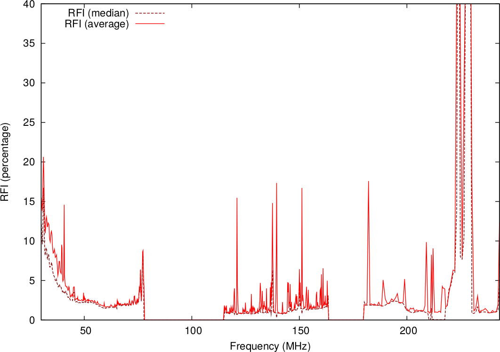

Introduction
============

AOFlagger makes it possible to detect radio-frequency interference in radio-observations.
In this process, often called "flagging" the data, samples that are contaminated by interference
are marked. As shown by the figure below, the frequencies covered by telescopes like LOFAR and the MWA are considerably
affected by radio-frequency
interference (RFI). Efficient RFI detection
is essential to obtain high quality images.

The AOFlagger software is aimed at being a fast and accurate flagger.
Implemented algorithms such as the SumThreshold method, background fitting techniques (smoothing, sliding window, median filters,
high-pass filters) and morphological operators can be combined into strategy scripts. These are
written in the `Lua language <https://www.lua.org/>`_. The default strategy performs well
on a wide range of telescope observations.
Further tweaking to accomodate for specific features of a telescope can sometimes improve the results.

The software consists of the flagger library (``libaoflagger``) that can be integrated into observatory pipelines by using the
Application Programming Interface (API). It also provides several programs to execute the flagger on measurement sets, tweak strategies and visualize results.
Tools are provided that can for example plot time-frequency diagrams and
power spectra, both interactively or from scripts.
The two main programs are :doc:`aoflagger <using_aoflagger>` and :doc:`rfigui <using_rfigui>`.
Furthermore, aoqplot can be used to visualize plots (:doc:`interactively <using_aoqplot>` or :doc:`scripted <programs_scripting>`).
The API is available as for programs written in C++ and Python.

AOFlagger is used by default for the LOFAR, MWA and Apertif radio telescope.
The software can run in a fully automated way, but a graphical interface (rfigui) is provided
to analyse results and tweak the strategy. The preferred input file format is the Casa Measurement Set (MS) format, but single dish SDFits files
are also supported.

I believe that the AOFlagger is the best available flagger, both in terms of accuracy and speed. It has been succesfully used on several
interferometric telescopes, including LOFAR, WSRT, Apertif, VLA, GMRT, ATCA and MWA, and the single-dish telescopes Parkes and Arecibo 305m.

History
^^^^^^^

The AOFlagger was originally written as part of my PhD thesis for the LOFAR Epoch of Reionization key science project, which
needed a fast flagger with high accuracy. Since then it was made more generic and functionality was added to work
on data from other observatories and at other frequency ranges.
