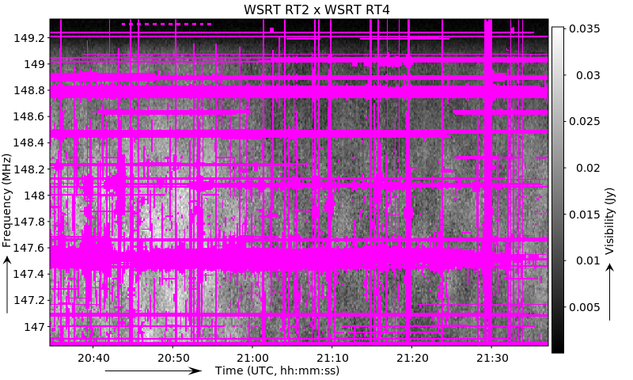
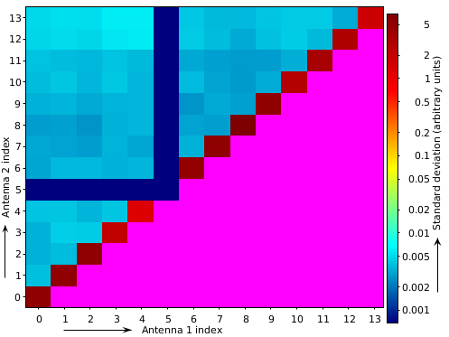

Scripted plotting
=================

Storing plots that describe the (RFI) quality of an observation can be useful for quality assessment.
Both ``rfigui`` and ``aoqplot`` have options that make it possible to save certain statistics or overview images.
The command-line options of these tools give access to these plotting capabilities from non-interactive pipelines or scripts.
When parameters are given on the command line that save images, the ``rfigui`` and ``aoqplot`` tools will not open their
default window and therefore do not require an X windows system to be running [1]_. In other words, the tools
will run as non-interactive command line programs.

Both ``rfigui`` and ``aoqplot`` provide parameter ``--help``, which will show a list of supported options.

``rfigui``
----------

The ``rfigui`` tool can be used to save time-frequency "heatmap" images, that show the flux of the correlations in a two-dimensional time and frequency display. The syntax is as follows:

.. code-block :: bash
    
    rfigui \
      -save-baseline <filename> <ant1> <ant2> <band> <seqindex>

Filename should end with an image extension. Supported formats are ``.png``, ``.pdf`` and ``.svg``. Note that ``.pdf`` and ``.svg`` are of higher quality than ``.png`` files. The created plots will by default be made from the "``DATA``" column. However, a different column can be selected with the option ``-data-column <name>``. The following example will save the correlated data from antennas 1 and 3: 

.. code-block :: bash
    
    rfigui \
      -data-column CORRECTED_DATA \
      -save-baseline WSRT-RT2xRT4.pdf 1 3 0 0 3C196_spw5_sub1.MS/

Which creates the following pdf:

  
It is also possible to repeat the '``-save-baseline``' option to save multiple images at once. This saves quite a few computations over saving the baselines one by one with separate ``rfigui`` calls.

``aoqplot``
-----------

The ``aoqplot`` syntax to save plots is as follows:

.. code-block :: bash
    
    aoqplot -save <filename prefix> <statistic name>

Note that unlike ``rfigui``, the ``aoqplot`` tool saves several images at once. The plots created are i) a per-baseline matrix plot; ii) a per antenna plot; iii) a spectrum; iv) a time-plot; and v) a time-frequency heatmap. The statistic name parameter is a case-sensitive name of the statistic that will be plotted over antenna/time/frequency, etc. The common statistics are: ``StandardDeviation``, ``DStandardDeviation`` (=stddev of difference between channels), ``Variance``, ``Mean``, ``RFIPercentage``, ``RFIRatio`` and ``Count`` (=visibility count). A full list of allowed statistics can be retrieved by typing ``aoquality liststats`` on the command line. However, not all allowed statistics are stored by default in a measurement set. This is an example ``aoqplot`` run:

.. code-block :: bash
    
    aoqplot -save aartfaac-stddev StandardDeviation aartfaac-testobs.ms/
     (1/1) Adding aartfaac-testobs.ms/ to statistics...
    Lowering time resolution...
    Lowering frequency resolution...
    Integrating baseline statistics to one channel...
    Regridding time statistics...
    Copying statistics...
    Integrating time statistics to one channel...
    Opening statistics panel...
    Saving aartfaac-stddev-antennas.pdf...
    Saving aartfaac-stddev-baselines.pdf...
    Saving aartfaac-stddev-baselinelengths.pdf...
    Saving aartfaac-stddev-timefrequency.pdf...
    Saving aartfaac-stddev-time.pdf...
    Saving aartfaac-stddev-frequency.pdf...

This is an example for the produced 'baselines' plot:

As can be seen from this image, antenna index 5 (WSRT RT5) is not working, and the autocorrelations show more power (as they should). Note that ``aoqplot`` uses the quality statistics tables inside the measurement set. These are normally produced by tools like ``DP3``, ``cotter`` or ``aartfaac2ms``; however, if a measurement set is not produced by one of those tools, it is necessary to create these tables manually. This can be done with the ``aoquality collect <obs.ms>`` command.

.. [1] Older versions of ``rfigui`` and ``aoqplot`` would require an X window system to be running even when running in command line mode. However, that was resolved in :doc:`AOFlagger version 2.10 <changelogs/v2.10>`.
